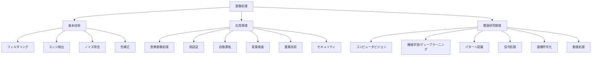

```mermaid
graph TD;
    A[画像処理] --> B[基本技術]
    B --> C[フィルタリング]
    B --> D[エッジ検出]
    B --> E[ノイズ除去]
    B --> F[色補正]

    A --> G[応用領域]
    G --> H[医療画像処理]
    G --> I[顔認証]
    G --> J[自動運転]
    G --> K[産業検査]
    G --> L[農業技術]
    G --> M[セキュリティ]

    A --> N[関連研究領域]
    N --> O[コンピュータビジョン]
    N --> P[機械学習/ディープラーニング]
    N --> Q[パターン認識]
    N --> R[信号処理]
    N --> S[画像符号化]
    N --> T[動画処理]
```