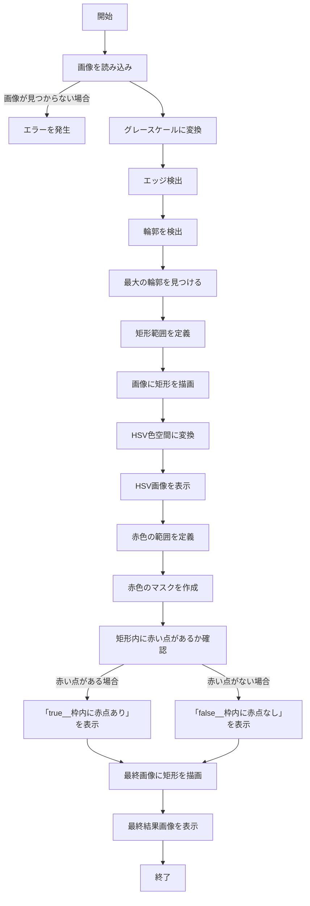

```mermaid
graph TD;
    A[開始] --> B[画像を読み込み]
    B -->|画像が見つからない場合| C[エラーを発生]
    B --> E[グレースケールに変換]
    E --> G[エッジ検出]
    G --> H[輪郭を検出]
    H --> I[最大の輪郭を見つける]
    I --> J[矩形範囲を定義]
    J --> L[画像に矩形を描画]
    L --> M[HSV色空間に変換]
    M --> N[HSV画像を表示]
    N --> O[赤色の範囲を定義]
    O --> Q[赤色のマスクを作成]
    Q --> R[矩形内に赤い点があるか確認]
    R -->|赤い点がある場合| S[「true__枠内に赤点あり」を表示]
    R -->|赤い点がない場合| T[「false__枠内に赤点なし」を表示]
    S --> U[最終画像に矩形を描画]
    T --> U[最終画像に矩形を描画]
    U --> V[最終結果画像を表示]
    V --> W[終了]
```
