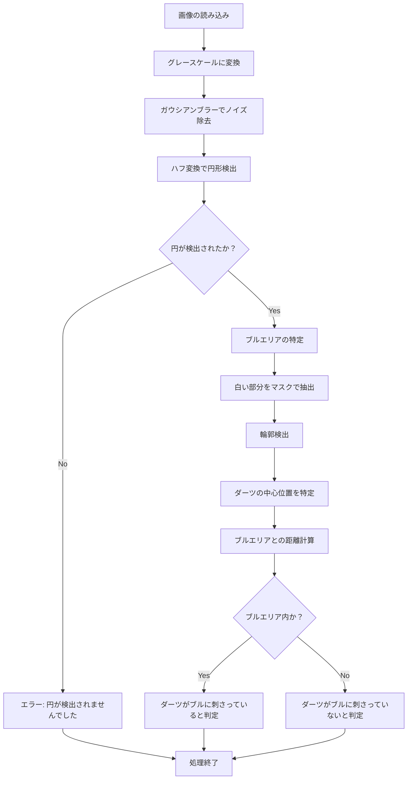

```mermaid
graph TD;
    1[画像の読み込み] --> 2[グレースケールに変換];
    2 --> 3[ガウシアンブラーでノイズ除去];
    3 --> 4[ハフ変換で円形検出];
    4 --> 5{円が検出されたか？};
    5 -->|Yes| 6[ブルエリアの特定];
    6 --> 7[白い部分をマスクで抽出];
    7 --> 8[輪郭検出];
    8 --> 9[ダーツの中心位置を特定];
    9 --> 10[ブルエリアとの距離計算];
    10 --> 11{ブルエリア内か？};
    11 -->|Yes| 12[ダーツがブルに刺さっていると判定];
    11 -->|No| 13[ダーツがブルに刺さっていないと判定];
    5 -->|No| 14[エラー: 円が検出されませんでした];
    14 --> 15[処理終了];
    12 --> 15;
    13 --> 15;
    15[処理終了];
```
